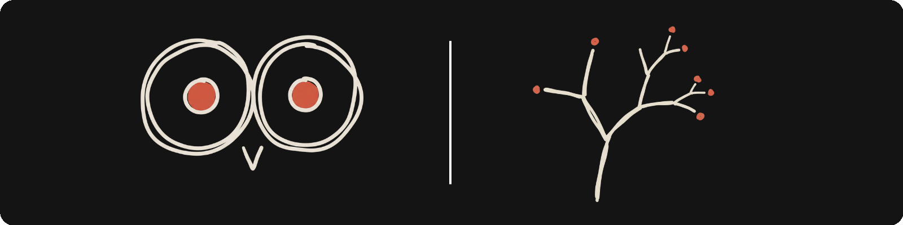

<p align="center">
  
</p>

<h1 align="center">Nightshift + Recursive</h1>

<p align="center">
  <strong>Two products. One repo.</strong><br/>
  <b>Nightshift</b> is an autonomous engineering product with two shipped loops -- Owl (hardening) and Raven (feature building).<br/>
  <b>Recursive</b> is a portable autonomous orchestration framework that can run on any codebase.
</p>

<p align="center">
  
  
  
  
  
</p>

---

## Two products, one repo

This repo ships two independent products that work together:

### Nightshift -- the product

Nightshift (`nightshift/`) is a Python package with two autonomous engineering loops:

- **Owl** (Loop 1 -- Hardening, 99%): point it at a repository, let it profile the stack, create an isolated worktree, find one production-readiness issue per cycle, and either reject or commit the fix behind guard rails. Supports Codex and Claude, diff scoring, multi-repo mode, prompt injection boundaries, and self-evaluation against [Phractal](https://github.com/fazxes/Phractal).

- **Raven** (Loop 2 -- Feature Building, 100%): give it a feature request in plain English and it will profile the repo, plan the work, decompose it into waves, spawn sub-agents, integrate the results, run E2E and readiness checks, and persist build state for resume/status flows.

### Recursive -- the framework

Recursive (`Recursive/`) is a portable autonomous orchestration framework. It provides the daemon loop, signal-driven role selection, operator prompts, agent lifecycle management, sub-agent review pipeline, and session memory. Recursive is designed to work on **any** codebase -- Nightshift is just the first project it operates on.

Recursive drives six operators each cycle via `Recursive/engine/pick-role.py`:

- **Builder**: reads the task queue, builds or fixes one scoped task, tests it, opens a PR, reviews it via sub-agents, and merges it
- **Reviewer**: picks one file, deep-reviews it against a checklist, fixes every issue found, and logs the review
- **Overseer**: triages the task queue, closes duplicates and obsolete work, updates stale metadata
- **Strategist**: gathers evidence across sessions, evaluations, and costs, then produces a top-down health report with auto-created follow-up tasks
- **Achiever**: measures autonomy score (0-100) across a 20-check scorecard, identifies the highest-impact human dependency, and eliminates it
- **Security checker**: red-team preflight that runs before each build -- scans for fragile paths, subprocess injection, credential leaks, and outputs a severity-classified pentest report

### How they fit together

```
Recursive (framework)          Nightshift (product)
┌─────────────────────┐       ┌──────────────────────┐
│  daemon.sh          │       │  owl/   (Loop 1)     │
│  pick-role.py       │       │    cycle.py          │
│  lib-agent.sh       │       │    scoring.py        │
│  operators/         │──────>│    readiness.py      │
│    build/           │       │                      │
│    review/          │       │  raven/ (Loop 2)     │
│    oversee/         │       │    planner.py        │
│    strategize/      │       │    decomposer.py     │
│    achieve/         │       │    subagent.py       │
│    security-check/  │       │    integrator.py     │
│  agents/            │       │    feature.py        │
│  lib/               │       │                      │
│  prompts/           │       │  core/  settings/    │
└─────────────────────┘       │  infra/ schemas/     │
         │                    └──────────────────────┘
         v
   .recursive/  (runtime state -- session memory for both)
```

Recursive orchestrates. Nightshift does the engineering work. `.recursive/` is the shared memory layer.

---

## This repo maintains itself

Most of the code in this repository was written, tested, reviewed, and merged by AI agents. The Recursive daemon (`Recursive/engine/daemon.sh`) auto-selects an operator each cycle, and Nightshift's Owl and Raven loops do the actual engineering.

The human role is operational: start the daemon and monitor it. The agents own the engineering loop -- including deciding what to work on.

**Proof points live in the repo, not in marketing copy.** Check them directly:

```bash
gh pr list --state merged --limit 50          # every merged PR
cat .recursive/sessions/index.md              # daemon sessions with timestamps
cat .recursive/handoffs/LATEST.md             # what the last session built
make tasks                                    # authoritative task queue summary
```

## Current state

Snapshot taken from live repo data on `2026-04-07`. Generated docs such as the
[vision tracker](.recursive/vision-tracker/TRACKER.md) and
[module map](.recursive/architecture/MODULE_MAP.md) are the source of truth when these
numbers change.

| Signal | Current reading | Source |
|--------|-----------------|--------|
| Overall vision progress | 92% | `.recursive/vision-tracker/TRACKER.md` |
| Owl (Loop 1 hardening) | 99% | `.recursive/vision-tracker/TRACKER.md` |
| Raven (Loop 2 feature builder) | 100% | `.recursive/vision-tracker/TRACKER.md` |
| Self-maintaining repo | 68% | `.recursive/vision-tracker/TRACKER.md` |
| Meta-prompt system | 79% | `.recursive/vision-tracker/TRACKER.md` |
| Tests | 847 passing | `python3 -m pytest nightshift/tests/ Recursive/tests/ -q` |
| Nightshift modules | 23 | `.recursive/architecture/MODULE_MAP.md` |
| Recursive modules | 7 | `Recursive/lib/` + `Recursive/engine/` |
| Merged PRs | 155+ | `gh pr list --state merged --json number` |
| Daemon sessions | 100+ | `.recursive/sessions/index.md` |
| Documented learnings | 90+ | `.recursive/learnings/INDEX.md` |

---

## Install

### Install the skill bundle

```bash
curl -sL https://raw.githubusercontent.com/Recusive/Nightshift/main/nightshift/scripts/install.sh | bash
```

This installs Nightshift's wrapper scripts and prompt assets into:

- `~/.codex/skills/nightshift`
- `~/.claude/skills/nightshift`

The installer does **not** create a global `nightshift` shell command. In a repo
checkout, use `python3 -m nightshift ...`. From an installed skill bundle, use
the wrapper scripts in `~/.codex/skills/nightshift/scripts/`.

### Repo setup

Add runtime artifacts to the target repo's `.gitignore`:

```bash
cat <<'EOF' >> .gitignore
Runtime/Nightshift/worktree-*/
Runtime/Nightshift/*.runner.log
Runtime/Nightshift/*.state.json
EOF
```

Optional per-repo config (copy and edit):

```bash
cp .nightshift.json.example .nightshift.json
```

## Running Nightshift

### From a repo checkout

Use the Python module entry point that the codebase actually ships:

```bash
python3 -m nightshift run --agent claude              # full overnight shift (Owl)
python3 -m nightshift test --agent claude --cycles 2   # short validation shift (Owl)
python3 -m nightshift summarize                        # print shift state JSON
python3 -m nightshift verify-cycle --worktree-dir PATH --pre-head HASH  # verify cycle offline
python3 -m nightshift plan "Add OAuth login"           # plan a feature build (Raven)
python3 -m nightshift build "Add OAuth login" --yes    # build a feature end-to-end (Raven)
python3 -m nightshift build --status                   # check build progress
python3 -m nightshift build --resume                   # resume interrupted build
python3 -m nightshift multi /repo1 /repo2 --agent claude --test --cycles 1  # multi-repo
python3 -m nightshift module-map --write               # generate architecture map
```

`python3 -m nightshift test ...` now keeps its state files, runner logs, and
linked worktree under `$TMPDIR/nightshift-test-runs/...` so evaluation clones
stay clean. Full `run` mode still writes repo-local runtime artifacts under
`Runtime/Nightshift/`.

### From the installed skill bundle

Use the bundled wrapper scripts:

```bash
~/.codex/skills/nightshift/nightshift/scripts/run.sh --agent claude
~/.codex/skills/nightshift/nightshift/scripts/test.sh --agent claude --cycles 2 --cycle-minutes 5
```

### Running the Recursive daemon

The Recursive daemon wraps Nightshift's loops with autonomous role selection,
session memory, and self-maintenance:

```bash
make daemon       # start the daemon (auto-picks operator each cycle)
make tasks        # show pending/blocked/in-progress task queue
make check        # full local CI gate (lint + typecheck + tests)
make test         # run the full test suite
make dry-run      # preview cycle prompt without spawning agents
make quick-test   # 2-cycle validation run (~10 min)
make clean        # remove runtime artifacts
```

Daemon examples:

```bash
tmux new-session -d -s nightshift "bash Recursive/engine/daemon.sh claude 60"
RECURSIVE_PENTEST_AGENT=codex tmux new-session -d -s nightshift "bash Recursive/engine/daemon.sh claude 60"
tmux capture-pane -t nightshift -p -S -15
```

## Config

Abridged example. Full source of truth: [`.nightshift.json.example`](.nightshift.json.example)

```json
{
  "agent": "codex or claude",
  "hours": 8,
  "cycle_minutes": 30,
  "verify_command": null,
  "blocked_paths": [".github/", "deploy/", "deployment/", "infra/", "k8s/", "ops/", "terraform/", "vendor/"],
  "blocked_globs": ["*.lock", "package-lock.json", "pnpm-lock.yaml", "yarn.lock", "bun.lockb", "Cargo.lock"],
  "max_fixes_per_cycle": 3,
  "max_files_per_fix": 5,
  "max_files_per_cycle": 12,
  "max_low_impact_fixes_per_shift": 4,
  "stop_after_failed_verifications": 2,
  "stop_after_empty_cycles": 2,
  "score_threshold": 3,
  "test_incentive_cycle": 3,
  "backend_forcing_cycle": 3,
  "category_balancing_cycle": 3,
  "claude_model": "claude-opus-4-6",
  "claude_effort": "max",
  "codex_model": "gpt-5.4",
  "codex_thinking": "extra_high",
  "notification_webhook": null,
  "readiness_checks": ["secrets", "debug_prints", "test_coverage"],
  "eval_frequency": 5,
  "eval_target_repo": "https://github.com/fazxes/Phractal"
}
```

If `verify_command` is left `null`, Nightshift tries to infer one from repo
signals such as `pyproject.toml`, `package.json`, `Cargo.toml`, or `go.mod`.

Environment variables:

- `RECURSIVE_CLAUDE_MODEL` -- override Claude model (default: claude-opus-4-6)
- `RECURSIVE_CODEX_MODEL` -- override Codex model (default: gpt-5.4)
- `RECURSIVE_CODEX_THINKING` -- Codex thinking level (default: extra_high)
- `RECURSIVE_BUDGET` -- max USD spend before daemon stops
- `RECURSIVE_PENTEST_AGENT` -- agent for security preflight (default: same as main)
- `RECURSIVE_PENTEST_MAX_TURNS` -- max turns for pentest agent
- `RECURSIVE_FORCE_ROLE` -- bypass role scoring (build/review/oversee/strategize/achieve)
- `RECURSIVE_PIPELINE_CHECKPOINTS` -- enable verification checkpoints (0/1)

## How Recursive picks what to do

The daemon reads live system signals each cycle and scores all five selectable
roles. The highest score wins, with tie-break favoring build. Key signals:

| Signal | Effect |
|--------|--------|
| 5+ consecutive builds | Triggers **review** |
| 50+ pending tasks | Triggers **oversee** |
| 15+ sessions since last strategy | Triggers **strategize** |
| Autonomy score < 70 | Triggers **achieve** |
| Urgent tasks in queue | Boosts **build** |

Security-check runs as a preflight before every build -- it is not scored.

Override with `RECURSIVE_FORCE_ROLE=review` to bypass scoring.
Full scoring math: `Recursive/ops/ROLE-SCORING.md`.

## How it keeps context between sessions

Both products are designed for stateless agents, so the repo carries the memory
in `.recursive/`:

- **Handoffs**: every session writes a structured summary to `.recursive/handoffs/`, and the next session starts from `LATEST.md`
- **Learnings**: agents read `.recursive/learnings/INDEX.md` first (90+ hard-won patterns), then open only the relevant learning files
- **Task queue**: work lives in `.recursive/tasks/`; urgent pending tasks outrank normal ones, then the queue falls back to lowest-numbered pending internal work. GitHub Issues with the `task` label are auto-synced.
- **Evaluations**: periodically runs Nightshift against Phractal and scores across 10 dimensions; low scores become tracked follow-up tasks
- **Session index**: every session is logged with timestamp, role, exit code, duration, cost, feature, and PR link

```bash
cat .recursive/handoffs/LATEST.md
cat .recursive/learnings/INDEX.md
make tasks
ls .recursive/evaluations/
cat .recursive/sessions/index.md
```

Humans can add work by opening GitHub issues with the `task` label:

```bash
gh issue create --title "Add dark mode" --label "task"
gh issue create --title "Fix CI" --label "task,urgent"
```

## Guard rails

Nightshift does not trust the model to "be careful." It verifies:

- commit + shift-log presence after every cycle
- blocked-path and lockfile violations (8 blocked paths, 6 lockfile patterns)
- repo verification commands (auto-inferred or configured)
- file deletion attempts
- repeated category or path tunnel vision (category balancing)
- circuit breaker: stops after 3 consecutive failures

Recursive adds its own layer:

- prompt/control-file modifications during self-maintenance (prompt guard)
- origin integrity checks (detects pushes that bypass the working tree)
- session cost tracking and budget enforcement

### Diff scorer (Nightshift)

Accepted fixes are scored `1-10` for production impact using category weight
(Security: 8, Error Handling: 6, Tests: 6, A11y: 5, etc.), diff content
analysis, test file bonuses, and multi-category bonuses. Below threshold
(default 3): revert the cycle. Above threshold: keep the commit.

### Prompt injection protection (Nightshift)

Instruction files from target repos (`CLAUDE.md`, `AGENTS.md`, etc.) are wrapped
in an untrusted boundary before the agent sees them. Symlinks are rejected,
files > 100KB are truncated, and total instruction context is capped at 200KB.
They are treated as coding convention references only, never as behavioral
directives.

### Self-modification guard (Recursive)

Before builder work starts, Recursive snapshots all framework control files
(operator SKILL.mds, `daemon.sh`, `autonomous.md`, etc.), runs a red-team
security-check preflight, and hard-resets back to `origin/main` before the
main session. After the session, it compares pre/post snapshots and surfaces
any control-file diff as an alert in the next cycle's prompt.

### Cost tracking (Recursive)

Session costs are parsed from agent stream-json logs. Per-session and cumulative
costs are tracked in `.recursive/sessions/`. Budget enforcement via
`RECURSIVE_BUDGET` can stop the daemon when cumulative spend exceeds the limit.

---

## Architecture

### Nightshift -- `nightshift/`

The product Python package: 23 production modules across 5 subdirectories.
The generated [module map](.recursive/architecture/MODULE_MAP.md) is the
authoritative inventory.

```text
nightshift/
├── cli.py                    # CLI entry point (run, test, plan, build, etc.)
├── __init__.py / __main__.py
│
├── core/                     # Shared foundations
│   ├── types.py              # TypedDicts for all data structures
│   ├── constants.py          # Thresholds, patterns, score maps
│   ├── errors.py             # Exception hierarchy
│   ├── shell.py              # Subprocess helpers
│   └── state.py              # Shift-state persistence
│
├── settings/                 # Configuration layer
│   ├── config.py             # Config loading and defaults
│   └── eval_targets.py       # Repo-specific eval defaults (Phractal)
│
├── owl/                      # Loop 1 -- Owl (Hardening)
│   ├── cycle.py              # Single-cycle orchestrator
│   ├── scoring.py            # Diff scorer (1-10)
│   └── readiness.py          # Production-readiness checks
│
├── raven/                    # Loop 2 -- Raven (Feature Builder)
│   ├── profiler.py           # Repo profiling
│   ├── planner.py            # Feature plan generation
│   ├── decomposer.py         # Plan -> waves -> sub-tasks
│   ├── subagent.py           # Sub-agent spawning
│   ├── coordination.py       # Wave coordination
│   ├── integrator.py         # Result integration
│   ├── e2e.py                # End-to-end verification
│   ├── summary.py            # Build summaries
│   └── feature.py            # Top-level build command
│
├── infra/                    # Infrastructure modules
│   ├── worktree.py           # Git worktree isolation
│   ├── multi.py              # Multi-repo mode
│   └── module_map.py         # Module-map generation
│
├── schemas/                  # JSON schemas
│   ├── nightshift.schema.json
│   ├── feature.schema.json
│   └── task.schema.json
│
├── scripts/                  # Shell wrappers
│   ├── install.sh            # Skill-bundle installer
│   ├── run.sh / test.sh      # Convenience runners
│   ├── check.sh              # Local CI gate
│   └── smoke-test.sh         # Quick sanity check
│
├── assets/
│   └── icon.png
│
└── tests/                    # Product test suite (847 tests)
    ├── test_nightshift.py
    ├── test_feature_build.py
    └── test_module_map.py
```

### Recursive -- `Recursive/`

A portable autonomous orchestration framework. Drives the daemon, role
selection, operator prompts, agent lifecycle, sub-agent reviews, and session
memory. Zero dependencies on `nightshift/` -- designed to work on any codebase.

```text
Recursive/
├── engine/                   # Daemon runtime
│   ├── daemon.sh             # Main daemon loop (hot-reloads each cycle)
│   ├── lib-agent.sh          # Agent lifecycle, prompt guard, session utils
│   ├── pick-role.py          # Signal-driven role scoring engine
│   ├── watchdog.sh           # Process watchdog
│   └── format-stream.py      # Stream-log formatter
│
├── operators/                # Role-specific prompt sets (SKILL.md + references/)
│   ├── build/                # Default workhorse: pick task, build, ship PR
│   ├── review/               # Deep file-by-file code review
│   ├── oversee/              # Task queue triage and metadata cleanup
│   ├── strategize/           # Big-picture health report with auto-created tasks
│   ├── achieve/              # Autonomy measurement and human-dependency elimination
│   └── security-check/       # Red-team preflight (read-only, runs before build)
│
├── agents/                   # Sub-agent prompts (specialist reviewers)
│   ├── code-reviewer.md      # Structure, types, tests, shell correctness
│   ├── architecture-reviewer.md  # Dependency flow, module boundaries, design
│   ├── docs-reviewer.md      # Changelog, handoff, tracker, cross-doc consistency
│   ├── safety-reviewer.md    # Secrets, subprocess safety, file system safety
│   └── meta-reviewer.md      # Daemon integrity, prompt health (framework PRs only)
│
├── lib/                      # Shared Python helpers (zero nightshift deps)
│   ├── cleanup.py            # Log rotation, branch pruning, task archival
│   ├── compact.py            # Handoff compression
│   ├── config.py             # Project config loader
│   ├── costs.py              # Session cost tracking and budget enforcement
│   └── evaluation.py         # Self-evaluation pipeline (10-dimension scoring)
│
├── prompts/                  # System prompts
│   ├── autonomous.md         # Universal rules prepended to every session
│   └── checkpoints.md        # Optional verification pipeline checkpoints
│
├── ops/                      # Operations documentation
│   ├── DAEMON.md             # Daemon guide with troubleshooting
│   ├── OPERATIONS.md         # Complete system map (42KB reference)
│   ├── PRE-PUSH-CHECKLIST.md # Safety checklist before pushing
│   └── ROLE-SCORING.md       # Deep dive into scoring math per role
│
├── scripts/                  # Framework utilities
│   ├── init.sh               # Bootstrap new Recursive project
│   ├── list-tasks.sh         # Task queue display
│   ├── rollback.sh           # Revert last N commits (recovery tool)
│   └── validate-tasks.sh     # Task YAML frontmatter validator
│
├── skills/                   # Skill definitions
│   └── setup/SKILL.md        # Project setup skill
│
├── templates/                # Structured-doc templates
│   ├── handoff.md            # Session handoff format
│   ├── evaluation.md         # Eval report format (10 dimensions)
│   ├── session-index.md      # Session index table header
│   ├── task.md               # Task file format (YAML frontmatter)
│   └── project-config.json   # .recursive.json template
│
└── tests/                    # Framework tests (92 tests)
    └── test_pick_role.py
```

### Runtime state -- `.recursive/`

14 directories of persistent state shared by both products. The daemon reads
and writes these each cycle. Not checked into source control for target repos;
versioned here because this repo is its own target.

```text
.recursive/
├── architecture/     # Generated module map (Nightshift)
├── autonomy/         # Autonomy score reports (Recursive)
├── changelog/        # Per-version changelogs
├── evaluations/      # Phractal eval results (Nightshift)
├── handoffs/         # Session handoff summaries (Recursive)
├── healer/           # Healer observation logs (Recursive)
├── learnings/        # Hard-won knowledge index
├── plans/            # Feature build plans (Nightshift/Raven)
├── reviews/          # Code review artifacts (Recursive)
├── sessions/         # Session index and logs (Recursive)
├── strategy/         # Strategy reports (Recursive)
├── tasks/            # Task queue (frontmatter YAML)
├── vision/           # Vision documents
└── vision-tracker/   # Auto-generated progress tracker
```

### Product output -- `Runtime/`

```text
Runtime/
└── Nightshift/       # Shift logs, state files, worktree links
```

Type checking is `mypy --strict`. Linting is Ruff. The local gate is
`make check`.

## Current frontier

Nightshift shipped:

- Owl (hardening loop) with worktrees, diff scoring, and guard rails (99%)
- Raven (feature builder) with plan/build/resume/status/sub-agents (100%)
- multi-repo mode, module map generation, prompt injection boundaries
- self-evaluation against Phractal with 10-dimension scoring

Recursive shipped:

- unified daemon with signal-driven role selection across 6 operators
- red-team security-check preflight with severity-classified pentest reports
- 5-agent sub-agent review pipeline (code, architecture, docs, safety, meta)
- cross-session learnings (90+), structured handoffs, and cost tracking
- autonomy measurement and human-dependency elimination (score: 85/100)
- GitHub Issues auto-sync to internal task queue

Open in the queue (69 pending tasks):

- fix remaining real-repo evaluation gaps on rejected runs
- automate release tagging and changelog/tracker updates
- improve task queue hygiene and session-index fidelity
- budget limiter triple-failure fix (daemon cost tracking)
- add monitoring / alerting integrations

See [.recursive/vision-tracker/TRACKER.md](.recursive/vision-tracker/TRACKER.md) for the
current scoreboard and [.recursive/tasks/](.recursive/tasks/) for the active backlog.

---

## Requirements

- Python 3.9+
- Git
- `claude` CLI or `codex` CLI
- `gh` CLI for PR/release automation
- `tmux` if you want long-running daemon sessions

---

## License

MIT
